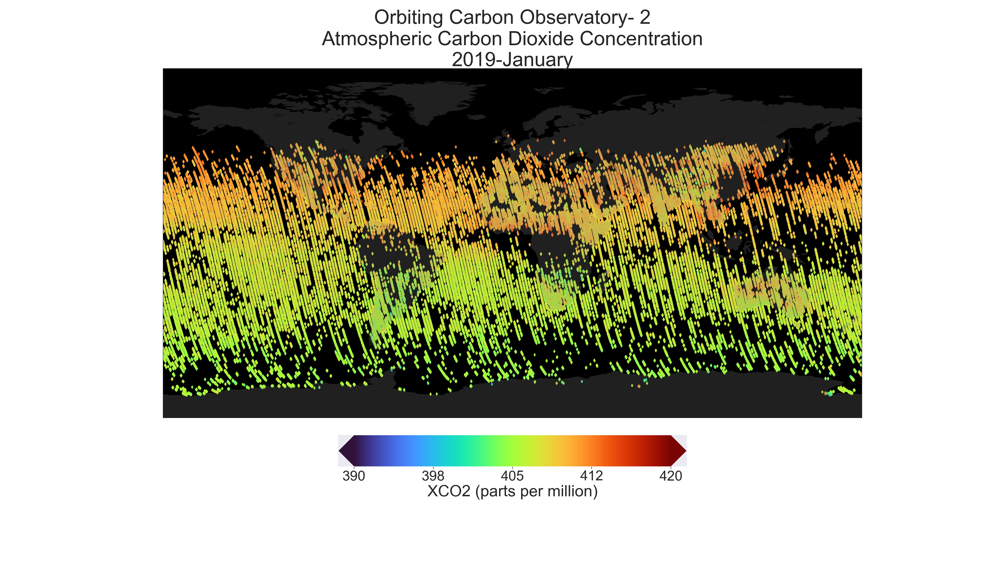

# OCO2-OCO3

<b>OCO2</b> is the first dedicated satellite to study Carbon Dioxide launched in July 2, 2014 and <b>OCO3</b> 
is the sister of OCO2 because it has similar instrument sensitivity and performance characteristics to OCO2.
When flying a payload on the International Space Station (ISS), the OCO3 mission was designed to fly with the flight spare.
This means we have 2 of the same instruments that is currently flying and since they fly differently - polar orbit versus a processing orbit
This is really fantastic opportunity for science because It really permits NASA to study CO2 over different areas of the globe. 

# Reading the OCO2/OCO3 Datasets
- Using the following libraries to perform data preprocessing before data anlysis and visualization
- Libraries: dask, netCDF, pandas, numpy

# Data Visualization
- Using different libraries for data visualization
- Libraries: matplotlib, Plotly, Basemap, seaborn

# Individual Files
- Each individual file has different instructions and steps
